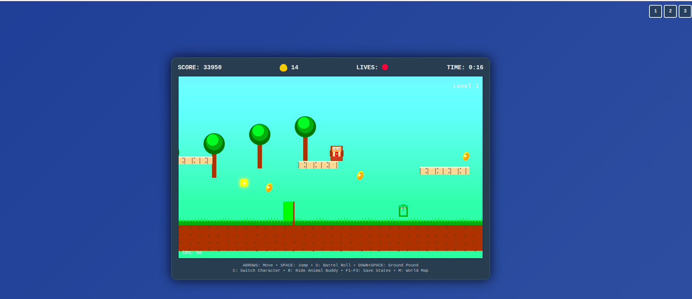

# 🍌 Donkey Kong Country - Web Edition

A faithful recreation of the classic SNES platformer Donkey Kong Country, built entirely with HTML5 Canvas and vanilla JavaScript. Experience the nostalgia of barrel-rolling through jungle levels, collecting bananas, and defeating Kremlings in your web browser!



## 🎮 Play Now

**[🕹️ Play the Game](https://your-username.github.io/donkey-kong-country-web/)**

## ✨ Features

### 🎯 Console-Quality Gameplay
- **Authentic DKC Mechanics** - Barrel rolling, ground pounding, and precise platforming
- **Character Switching** - Play as both Donkey Kong and Diddy Kong with unique abilities
- **Multiple Levels** - 5 challenging levels with increasing difficulty
- **Power-ups & Collectibles** - Extra lives, speed boosts, invincibility stars, and more
- **Checkpoint System** - Save your progress throughout each level
- **Combo System** - Chain enemy defeats for bonus points

### 🎨 Visual Excellence
- **Pixel-Perfect Sprites** - Hand-crafted character animations and detailed environments
- **Parallax Scrolling** - Multi-layer backgrounds for depth and immersion
- **Particle Effects** - Dynamic dust clouds, sparkles, and impact effects
- **CRT Filter** - Optional retro TV scanline effect for authentic feel
- **Smooth Animations** - 60fps gameplay with fluid character movement

### 🎵 Audio & Effects
- **8-bit Sound Effects** - Authentic retro audio using Web Audio API
- **Dynamic Music** - Different tracks for various game states
- **Screen Shake** - Satisfying feedback for impacts and special moves
- **Volume Controls** - Adjustable music and sound effect levels

### 🎮 Modern Controls
- **Keyboard Support** - Arrow keys, Space, and special move keys
- **Gamepad Support** - Full Xbox/PlayStation controller compatibility
- **Responsive Design** - Works on desktop, tablet, and mobile devices
- **Fullscreen Mode** - Press F11 for immersive gaming experience

### 💾 Console Features
- **Title Screen** - Classic game intro with animated elements
- **High Score System** - Local storage saves your best scores
- **Pause Functionality** - Press ESC to pause/resume gameplay
- **Settings Menu** - Customize audio, graphics, and difficulty
- **Achievement System** - Unlock rewards for special accomplishments

## 🕹️ Controls

### Keyboard
| Key | Action |
|-----|--------|
| ← → | Move left/right |
| ↑ ↓ | Climb ladders |
| Space | Jump / Double jump |
| S | Barrel roll attack |
| ↓ + Space | Ground pound |
| C | Switch character (DK ↔ Diddy) |
| ESC | Pause/Resume |
| F11 | Toggle fullscreen |

### Gamepad
| Button | Action |
|--------|--------|
| D-pad / Left stick | Movement |
| A (Cross) | Jump |
| B (Circle) | Barrel roll |
| X (Square) | Character switch |
| Start | Pause menu |

## 🚀 Getting Started

### Quick Start
1. **Clone the repository**
   ```bash
   git clone https://github.com/your-username/donkey-kong-country-web.git
   cd donkey-kong-country-web
   ```

2. **Start a local server**
   ```bash
   # Using Python 3
   python3 -m http.server 8080
   
   # Using Node.js (if you have http-server installed)
   npx http-server -p 8080
   
   # Using PHP
   php -S localhost:8080
   ```

3. **Open your browser**
   Navigate to `http://localhost:8080` and start playing!

### Development Setup
```bash
# Clone the repository
git clone https://github.com/your-username/donkey-kong-country-web.git
cd donkey-kong-country-web

# No build process required - it's vanilla JavaScript!
# Just serve the files with any HTTP server
```

## 📁 Project Structure

```
donkey-kong-country-web/
├── index.html              # Main game page
├── dkc-console-enhanced.js  # Core game engine
├── dkc-functional.js        # Simplified version
├── dkc-visual-enhanced.js   # Visual effects version
├── README.md               # This file
├── LICENSE                 # MIT License
├── assets/                 # Game assets (if any)
└── docs/                   # Documentation
```

## 🎯 Game Mechanics

### Characters
- **Donkey Kong** - Stronger, can break more blocks, slower movement
- **Diddy Kong** - Faster, higher jumps, more agile

### Power-ups
- **🍌 Bananas** - Collect for points (100 each)
- **❤️ Extra Life** - Gain an additional life
- **⚡ Speed Boost** - Temporary speed increase
- **⭐ Invincibility** - Brief invulnerability period
- **↑ Double Jump** - Enables double jump ability

### Enemies
- **Kremlings** - Classic crocodile enemies that patrol platforms
- **Defeat Methods** - Jump on them, barrel roll, or ground pound

## 🛠️ Technical Details

### Built With
- **HTML5 Canvas** - For rendering graphics
- **Vanilla JavaScript** - No frameworks or libraries
- **Web Audio API** - For sound effects and music
- **Local Storage** - For saving high scores and settings
- **Gamepad API** - For controller support

### Performance
- **60 FPS** - Smooth gameplay on modern browsers
- **Optimized Rendering** - Efficient canvas drawing with culling
- **Memory Management** - Proper cleanup of particles and effects
- **Mobile Friendly** - Responsive design for touch devices

### Browser Compatibility
- ✅ Chrome 60+
- ✅ Firefox 55+
- ✅ Safari 11+
- ✅ Edge 79+
- ✅ Mobile browsers (iOS Safari, Chrome Mobile)

## 🎨 Customization

### Adding New Levels
```javascript
// In dkc-console-enhanced.js, modify the levels array:
this.levels = [
    { name: "Your Level", theme: "jungle", difficulty: 1 },
    // Add more levels here
];
```

### Creating Custom Themes
```javascript
// Add new themes in the generateLevel function:
switch(level.theme) {
    case 'your_theme':
        // Define platforms, enemies, and decorations
        break;
}
```

### Modifying Characters
```javascript
// Adjust character stats in the switchCharacter function:
if (this.currentCharacter === 'your_character') {
    this.player.speed = 6;
    this.player.jumpPower = 18;
    // Add custom abilities
}
```

## 🤝 Contributing

We welcome contributions! Here are some ways you can help:

### 🐛 Bug Reports
- Use the [Issues](https://github.com/your-username/donkey-kong-country-web/issues) tab
- Include browser version and steps to reproduce
- Screenshots or videos are helpful

### 💡 Feature Requests
- **New Levels** - Design and implement additional stages
- **Characters** - Add Cranky Kong, Funky Kong, or other DKC characters
- **Power-ups** - Create new collectible items and abilities
- **Enemies** - Implement more enemy types from the original game
- **Audio** - Add more sound effects or music tracks

### 🔧 Code Contributions
1. Fork the repository
2. Create a feature branch (`git checkout -b feature/amazing-feature`)
3. Commit your changes (`git commit -m 'Add amazing feature'`)
4. Push to the branch (`git push origin feature/amazing-feature`)
5. Open a Pull Request

### 📝 Development Guidelines
- **Code Style** - Use consistent indentation and naming conventions
- **Comments** - Document complex game mechanics and algorithms
- **Testing** - Test on multiple browsers and devices
- **Performance** - Maintain 60fps gameplay on target devices

## 🎮 Gameplay Tips

### For Beginners
- **Master the Basics** - Learn to jump and roll before attempting advanced moves
- **Collect Everything** - Bananas give points and extra lives at 100 bananas
- **Use Checkpoints** - They save your progress through longer levels
- **Character Switching** - Use DK for strength, Diddy for speed and agility

### Advanced Techniques
- **Barrel Roll Chains** - Roll through multiple enemies for combo bonuses
- **Ground Pound Timing** - Use ground pound to stun groups of enemies
- **Double Jump Mastery** - Essential for reaching secret areas
- **Speed Running** - Complete levels quickly for time bonuses

## 📊 Achievements

- 🍌 **Banana Collector** - Collect 100 bananas in a single playthrough
- 🎯 **Combo Master** - Achieve a 5x enemy defeat combo
- ⚡ **Speed Runner** - Complete a level in under 2 minutes
- 🏆 **Perfect Run** - Complete a level without taking damage
- 🎮 **Game Master** - Complete all levels with maximum score

## 📈 Roadmap

### Version 1.1 (Planned)
- [ ] **World Map** - Visual level selection screen
- [ ] **Boss Battles** - King K. Rool and other bosses
- [ ] **Animal Buddies** - Rambi, Enguarde, and Squawks
- [ ] **Bonus Rooms** - Hidden areas with extra challenges
- [ ] **Multiplayer** - Local co-op gameplay

### Version 1.2 (Future)
- [ ] **Level Editor** - Create and share custom levels
- [ ] **Online Leaderboards** - Global high score competition
- [ ] **Mobile Controls** - Touch-optimized interface
- [ ] **Save System** - Progress persistence across sessions
- [ ] **Accessibility** - Colorblind support and keyboard alternatives

## 🏆 Credits

### Development
- **Game Engine** - Built from scratch with HTML5 Canvas
- **Sprites & Animation** - Hand-crafted pixel art inspired by DKC
- **Audio** - 8-bit sound effects using Web Audio API
- **Level Design** - Original levels inspired by classic DKC gameplay

### Inspiration
- **Rare Ltd.** - Original Donkey Kong Country series
- **Nintendo** - Donkey Kong character and universe
- **Retro Gaming Community** - Feedback and testing

## 📄 License

This project is licensed under the MIT License - see the [LICENSE](LICENSE) file for details.

### Fair Use Notice
This is a fan-made tribute to the original Donkey Kong Country series. All character names and game concepts are property of their respective owners. This project is created for educational and entertainment purposes only.

## 🌟 Support the Project

If you enjoy this game, please:
- ⭐ **Star this repository** on GitHub
- 🐛 **Report bugs** and suggest improvements
- 🤝 **Contribute code** or artwork
- 📢 **Share with friends** who love retro gaming
- 💬 **Join discussions** in the Issues section

## 📞 Contact

- **GitHub Issues** - For bugs and feature requests
- **Email** - davidkljajo@gmail.com


---

**Made with ❤️ for retro gaming enthusiasts**

*"It's on like Donkey Kong!"* 🦍🍌
